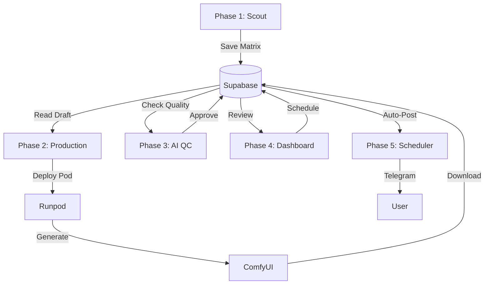

# Nong Kung Agency — Project Walkthrough

โปรเจกต์ **Nong Kung Agency** ระบบบริหารจัดการ AI Influencer แบบครบวงจร ได้รับการพัฒนาเสร็จสมบูรณ์ตามแผนทั้ง 5 Phases พร้อมใช้งานแล้วครับ

---

## 🏗️ Project Architecture

ระบบถูกออกแบบให้ทำงานร่วมกันผ่าน **Supabase** และ **Next.js 15** โดยมีการแยกส่วนงาน (Phases) ชัดเจน:

---

## 🚀 Key Features Implemented

### 0. Foundation
- **Next.js 15 (App Router)**: โครงสร้างโปรเจกต์ที่ทันสมัยและรวดเร็ว
- **Supabase Integration**: ฐานข้อมูล 6 ตาราง ครอบคลุมทุก Phase ตั้งแต่แผนงานไปจนถึง Engagement Logs
- **Shared Types**: ระบบ TypeScript ที่แข็งแรง

### 1. The Strategic Scout
- **Job**: `jobs/weekly-planner.ts`
- **Logic**: ดึง Trend จาก Apify → Gemini 1.5 Pro วิเคราะห์ → สร้าง 21 คอนเทนต์รายสัปดาห์

### 2. The Automated Production
- **Job**: `jobs/production-runner.ts`
- **Logic**: Auto-Deploy Runpod GPU → Batch Process ใน ComfyUI → รักษาความต่อเนื่อง (Seed) ระหว่าง SFW/NSFW → Auto-Terminate Pod

### 3. The AI-QC Manager
- **Job**: `jobs/qc-manager.ts`
- **Logic**: ใช้ Gemini Vision ตรวจสอบ Artifacts และความสมจริง → Re-gen Loop อัตโนมัติหากคะแนนต่ำกว่า 80

### 4. The Approval Dashboard
- **URL**: `/dashboard`
- **UI**: Premium Dark Theme, Calendar View การ์ดคอนเทนต์
- **Security**: **NSFW Blurring** เป็นค่าเริ่มต้น พร้อมปุ่ม Unblur
- **Workflow**: แก้ไข Caption และกด Approve เพื่อตั้งเวลาโพสต์

### 6. Dynamic API Configuration
- **Settings Page**: `/dashboard/settings` สำหรับจัดการ API Keys ทั้งหมดผ่าน UI
- **Guides**: มีคำแนะนำบอกขั้นตอนการขอ Key ของแต่ละเจ้า
- **Verification**: ระบบสามารถกด **"Test Connection"** เพื่อเช็คว่า Key ใช้ได้จริงไหมก่อนเริ่มรันงาน
- **Hybrid Config**: ระบบจะเช็คค่าจาก Supabase ก่อน และจะใช้ `.env.local` เป็นค่าสำรอง (Fallback)

---

## 🛠️ How to Trigger the Jobs
...
| Phase | API Endpoint |
|---|---|
| Phase 1 | `/api/jobs/phase1-planner` (POST) |
| Phase 2 | `/api/jobs/phase2-production` (POST) |
| Phase 3 | `/api/jobs/phase3-qc` (POST) |
| Phase 5 | `/api/jobs/phase5-poster` (POST) |
| Config Test | `/api/jobs/test-connection` (POST) |

---

## 📝 Next Steps for User
1. **API Keys**: อย่าลืมเติม API Keys ที่เหลือใน `.env.local` (Gemini, Apify, Runpod, Telegram)
2. **Run Dev**: รัน `npm run dev` และไปที่ `http://localhost:3000/dashboard` เพื่อดูหน้าตาระบบครับ
3. **Storage**: ตรวจสอบโฟลเดอร์ `storage/images` เพื่อดูภาพที่เจนเสร็จแล้ว

> [!TIP]
> **Proactive Setup**: ผมได้สร้าง Git Remote และตั้งค่า GitHub ไว้ให้แล้ว สามารถ `git push` งานทั้งหมดขึ้น Repo ใหม่ได้ทันทีครับ
